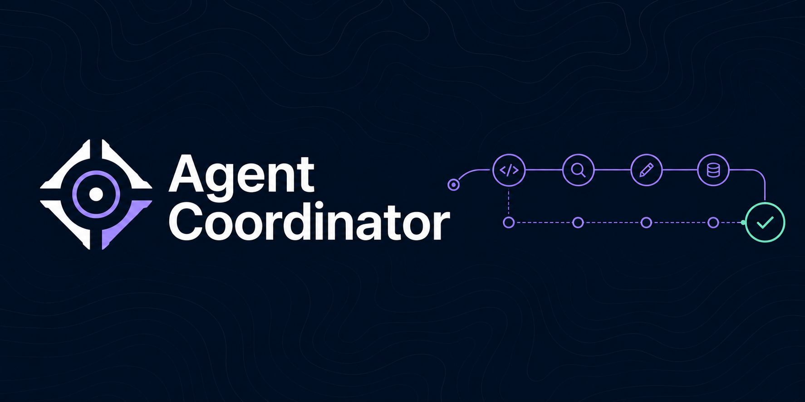
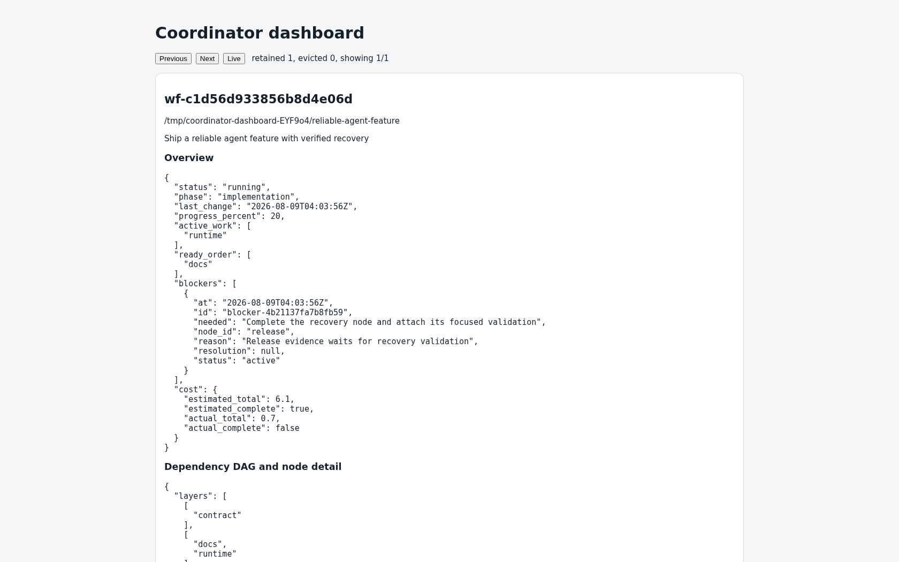

<div align="center">

# Agent Coordinator

**Turn complex Codex work into a bounded, observable workflow with evidence at every handoff.**

Durable revisioned state, explicit dependencies and write scopes, evidence-routed specialists,
and verified recovery—without adding Coordinator files to the repository being orchestrated.

</div>

## Install

**Requires Python 3.11+ on Linux, macOS, or Windows.** Close Codex first. These commands install
Coordinator globally for the current user; after success, reopen Codex in a new session.

### Linux and macOS

```sh
d=$(mktemp -d) && trap 'rm -rf "$d"' EXIT && curl -fL https://github.com/alanhoff/agent-coordinator/releases/latest/download/install.py -o "$d/install.py" && curl -fL https://github.com/alanhoff/agent-coordinator/releases/latest/download/SHA256SUMS -o "$d/SHA256SUMS" && python3 -c 'import hashlib,pathlib,sys; d=pathlib.Path(sys.argv[1]); expected=next((line.split()[0] for line in (d/"SHA256SUMS").read_text(encoding="ascii").splitlines() if line.split()[1:]==["install.py"]), None); actual=hashlib.sha256((d/"install.py").read_bytes()).hexdigest(); sys.exit(0 if expected is not None and actual==expected else 1)' "$d" && python3 "$d/install.py" ensure-global --between-sessions
```

### Windows PowerShell

```powershell
$d=Join-Path ([IO.Path]::GetTempPath()) ([guid]::NewGuid()); New-Item -ItemType Directory $d | Out-Null; try { curl.exe -fL https://github.com/alanhoff/agent-coordinator/releases/latest/download/install.py -o (Join-Path $d install.py); if ($LASTEXITCODE -ne 0) { exit $LASTEXITCODE }; curl.exe -fL https://github.com/alanhoff/agent-coordinator/releases/latest/download/SHA256SUMS -o (Join-Path $d SHA256SUMS); if ($LASTEXITCODE -ne 0) { exit $LASTEXITCODE }; python -c 'import hashlib,pathlib,sys; d=pathlib.Path(sys.argv[1]); expected=next((line.split()[0] for line in (d/"SHA256SUMS").read_text(encoding="ascii").splitlines() if line.split()[1:]==["install.py"]), None); actual=hashlib.sha256((d/"install.py").read_bytes()).hexdigest(); sys.exit(0 if expected is not None and actual==expected else 1)' $d; if ($LASTEXITCODE -ne 0) { exit $LASTEXITCODE }; python (Join-Path $d install.py) ensure-global --between-sessions; if ($LASTEXITCODE -ne 0) { exit $LASTEXITCODE } } finally { Remove-Item -Recurse -Force $d }
```

Both commands download only `install.py` and `SHA256SUMS` before verification. The verified
installer anonymously fetches and validates `manifest.json` and `coordinator-latest.zip`, checks
their exact inventory and manifest identity, and performs a recoverable current-user transaction.
To inspect first, download those same two files, compare the `install.py` SHA-256 entry, review the
script, then run `python3 install.py ensure-global --between-sessions` (`python` on Windows).

## Why Coordinator

- **Recovery is part of the protocol.** Atomic, revisioned snapshots record launch claims before
  external calls, require reconciliation after uncertain responses, and fence replaced controllers.
- **Ownership is explicit.** Every DAG node carries dependencies, acceptance criteria, one role,
  and a repository-relative write scope; overlapping work is serialized.
- **Routing follows evidence.** Eight installed roles—`architect`, `designer`, `documenter`,
  `fixer`, `implementer`, `researcher`, `reviewer`, and `validator`—have no model pins. The
  controller selects a validated model and effort for each attempt.
- **Your project stays clean.** Packages, roles, configuration, sessions, locks, recovery data,
  and workflow state live under current-user global locations, never in the target repository.
- **Observation cannot steer execution.** The dashboard reads committed snapshots and exposes no
  workflow mutation endpoint.
- **The release surface is closed.** Deterministic release builds have an exact inventory and an
  independent verifier. The Python 3.11+ runtime uses only the standard library.

## Give Codex a controller brief

Each prompt explicitly invokes `$coordinator`. These are controller instructions, not fixed
topologies: Coordinator derives the smallest useful graph and routes attempts from current evidence.

**Deliver a feature with bounded parallel ownership**

```text
$coordinator Ship the saved-search feature. Inspect repository instructions, persist the acceptance
criteria, and build the smallest dependency DAG. Parallelize only independent write scopes, route
each node from evidence, validate the integrated behavior, and finish only at a verified commit.
```

**Diagnose an intermittent test before changing production**

```text
$coordinator Reproduce and diagnose the intermittent checkout test first. Keep diagnosis, the
smallest owner-layer fix, and independent validation as bounded dependent work. Preserve failure
evidence, reconcile uncertain launches, and do not mark the workflow complete without a verified run.
```

**Resume a migration safely**

```text
$coordinator Resume the interrupted schema migration workflow. Reconcile the repository and every
uncertain launch before retrying, preserve completed evidence, replan only unclaimed future work,
and validate rollback and forward-migration behavior before finishing.
```

**Audit a release without modifying it**

```text
$coordinator Perform a read-only release audit. Compare the tag, manifest, checksums, archive
inventory, and documented install contract. Assign bounded research and validation scopes, make no
repository changes, and return findings with exact evidence and unresolved limitations.
```

**Compare architectures from repository evidence**

```text
$coordinator Compare the two proposed event-processing architectures against current repository
boundaries and requirements. Route bounded research and architecture nodes, state tradeoffs and
missing evidence, and return a recommendation without implementing either option.
```

## Operate

Run preflight before orchestration, then open the local read-only dashboard when useful:

```sh
python3 ~/.agents/skills/coordinator/scripts/doctor.py preflight --repo /absolute/repository --json
python3 ~/.agents/skills/coordinator/scripts/dashboard.py watch --once
python3 ~/.agents/skills/coordinator/scripts/dashboard.py serve --open
```

On Windows, use `python` and paths under `%USERPROFILE%`. The installed `SKILL.md` is the controller
protocol. In compact form, a launch moves through **claim → bind → run → validate → finish**:

1. The controller creates a dependency-safe node with acceptance criteria, route, and write scope.
2. It commits a unique launch claim before calling an agent provider, then binds the observed child.
3. The specialist works only its node; the controller inspects artifacts and validation evidence.
4. `finish` requires successful visible nodes, resolved requirements and blockers, validation, and a
   full verified commit checkpoint.

If a provider response is uncertain, Coordinator records `reconcile_required`; the controller must
find and bind the existing child or prove that none exists before retrying. A replacement controller
uses explicit `controller-takeover` and `resume`, fencing the prior epoch before further mutation.

## See the workflow without touching it



*Genuine capture from a disposable public demo workflow—not generated artwork.*

Humans can inspect progress, active and ready work, DAG layers and critical path, blockers, recovery
state, capacity, attempts, and estimated or actual cost when known. `watch`, loopback `serve`, and
self-contained `render` all derive the same view from validated committed snapshots. Dashboard
requests cannot mutate, initialize, repair, lock, cache, or clean workflows.

```sh
python3 ~/.agents/skills/coordinator/scripts/dashboard.py watch --workflow-id WORKFLOW --once
python3 ~/.agents/skills/coordinator/scripts/dashboard.py serve --workflow-id WORKFLOW --open
python3 ~/.agents/skills/coordinator/scripts/dashboard.py render --workflow-id WORKFLOW --out /explicit/report.html
```

## Global footprint, updates, and migration

| Current-user location | Contents |
|---|---|
| `~/.agents/skills/coordinator` | Verified package and controller protocol |
| `~/.codex/agents/coordinator` | Eight role definitions |
| `~/.codex/config.toml` | Coordinator-owned marked semantic keys; unrelated configuration is preserved |
| `~/.agent-coordinator` | Private metadata, locks, recovery, sessions, and workflow state |

Coordinator creates no hooks, state, locks, roles, configuration, or package files in repositories it
orchestrates. Version 3 does **not** automatically adopt, update, or delete a v2 project-local
installation. Review and remove the old Coordinator-only project commit or files with version control,
preserving your changes, then install v3 globally and run preflight.

Between Codex sessions:

```sh
python3 ~/.agents/skills/coordinator/scripts/install.py status
python3 ~/.agents/skills/coordinator/scripts/install.py check-updates
python3 ~/.agents/skills/coordinator/scripts/install.py ensure-global --between-sessions
```

`check-updates` exits 1 when an update is available. If installation was interrupted, first run the
zero-write `install.py recovery-status --json` and use only the exact rollback command it returns.

## Project

Agent Coordinator is MIT licensed. Contributions and focused reports are welcome:

- [Contributing](CONTRIBUTING.md)
- [Security policy](SECURITY.md) — report vulnerabilities privately, not in a public issue
- [Changelog](CHANGELOG.md)
- [License](LICENSE)
- [GitHub repository](https://github.com/alanhoff/agent-coordinator)
- [Public issues](https://github.com/alanhoff/agent-coordinator/issues)
